# Autonomous Life Simulation Architecture (M002)

## Overview

Milestone M002 establishes that Gloop is an autonomous living creature on the user's desktop. Time passes for Gloop continuously, needs decay and recover based on wall-clock progression, autonomous decisions and moods emerge deterministically, and offline life is accurately simulated without requiring external AI APIs or cloud connections.

---

## Architectural Principles & Subsystems

```mermaid
graph TD
    subgraph Public Brain
        Identity[brain/species/identity.json]
        LifeBlueprint[brain/species/life.json]
        ReactionPack[brain/species/reactions.json]
    end

    subgraph Pure Simulation Core
        RNG[Deterministic PRNG 32-bit]
        TimeUtils[Wall-Clock Calculations]
        MoodEngine[Derived Mood Engine]
        AutonomousEngine[Utility Decision Engine]
        InteractionEngine[Care & Status Actions]
        OfflineEngine[Analytical Catch-up]
        SimCore[SimulationCore Facade]
    end

    subgraph Runtime Authority: Main Pet Window
        Coordinator[SimulationCoordinator]
        PixiRender[Pixi Procedural Renderer]
        ReactionBubble[Speech & Thought Bubble]
    end

    subgraph Secondary Windows: Companion Menu
        CareView[Care & Status View]
        Menu[Companion Menu]
    end

    subgraph Private Local Persistence: SQLite
        PetProfile[(pet_profile)]
        PetState[(pet_state)]
        LifeEvents[(pet_life_events)]
    end

    LifeBlueprint --> SimCore
    ReactionPack --> SimCore
    Identity --> PixiRender

    Coordinator --> SimCore
    Coordinator --> PetState
    Coordinator --> LifeEvents
    Coordinator --> PixiRender
    Coordinator --> ReactionBubble

    Coordinator -- IPC Broadcast State --> CareView
    CareView -- IPC Interaction Request --> Coordinator
```

### 1. Pure Simulation Core (`src/simulation/`)
- **Deterministic & Side-Effect Free**: Computations do not call `Date.now()`, `Math.random()`, React hooks, Tauri APIs, or SQLite queries directly. Time and RNG states are explicitly injected.
- **Strictly Invariant**: All 4 needs (`satiety`, `energy`, `fun`, `social`) are clamped to `[0, 100]` under all circumstances. Gloop never dies from neglect.
- **Fully Testable**: Pure math enables fast unit testing of complex life scenarios across hours, days, and months in milliseconds.

### 2. Wall-Clock Authoritative Time (`src/simulation/time/`)
- Simulation calculations advance from elapsed wall-clock timestamps: `elapsedMs = now - simulationUpdatedAt`.
- Survives OS sleep, laptop lid close, WebView occlusion/throttling, hidden tray states, and application restarts.
- Does not rely on animation frame intervals or fragile `setInterval` increments for gameplay authority.

### 3. Runtime Authority & Multi-Window IPC (`src/simulation/runtime/`)
- **Single Runtime Authority**: ONLY the `main` pet window instantiates and runs the `SimulationCoordinator`.
- **Secondary Window State Flow**: The companion-menu popup runs in read/command mode:
  - Listens to `simulation-state-updated` events emitted from the main window.
  - Sends `perform-pet-interaction` requests to the main window.
  - Never instantiates a competing simulation or executes duplicate writes to SQLite.

### 4. Analytical Offline Catch-Up (`src/simulation/engine/offlineEngine.ts`)
- Computes multi-phase awake and sleeping progressions in $O(1)$ time upon application resume/start.
- Seamlessly handles 10-minute pauses, 8-hour workday absences, and 30-day absences without per-tick loops.
- Evaluates return duration bands (`return.short`, `return.medium`, `return.long`, `return.very_long`) and schedules a single contextual return reaction line.

### 5. Local Private Life Event Stream (`src/persistence/lifeEventRepository.ts`)
- Records notable life moments (`pet.born`, `interaction.*`, `sleep.*`, `simulation.offline_catchup`, `owner.returned`) to SQLite `pet_life_events`.
- Bounded growth policy: regularly prunes older low-importance events while preserving high-importance milestones ($\ge 0.70$).
- Strict privacy boundary: stores zero user OS activity, window titles, or desktop filenames.

### 6. Public Brain vs. Private Instance Data
- **Public Git (`brain/`)**: Version-controlled species identity, baseline life tuning (`decayRates`, `decisionIntervals`, `weights`, `thresholds`), reaction dialog pools, and JSON schemas.
- **Private Local (`sqlite:tamagotchi.db`)**: Local instance identity, dynamic need levels, awake/asleep counters, and private life timeline.
